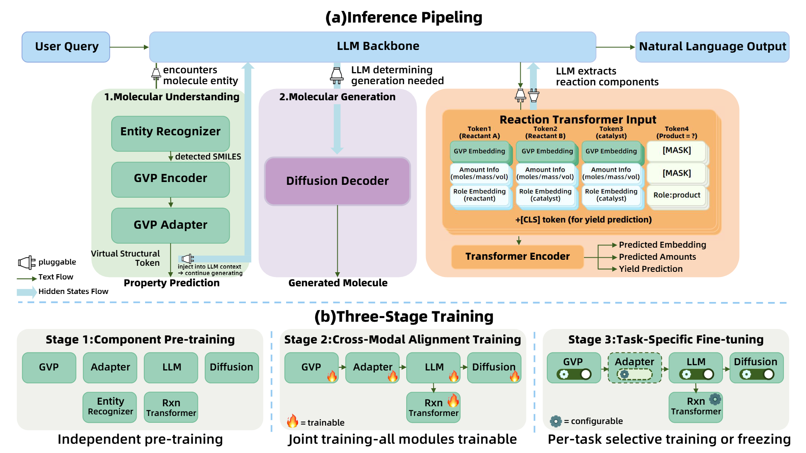

<div align="center">
<h1>SciCore-Mol: Augmenting Large Language Models with Pluggable Molecular Cognition Modules</h1>

<a href='SciCore_Mol_Technical_Report.pdf'></a>
<a href='https://huggingface.co/openbmb/SciCore-Mol'></a>

**Yuxuan Chen**<sup>1</sup>,
**Changwei Lv**<sup>2</sup>,
**Yunduo Xiao**<sup>2</sup>,
**Wei Wang**<sup>3</sup>,
**Li Jin**<sup>3</sup>,
**Yukun Yan**<sup>4</sup>,
**Zheni Zeng**<sup>5†</sup>,
**Zhiyuan Liu**<sup>4</sup>

<sup>4</sup>Tsinghua University &nbsp;&nbsp; <sup>†</sup>Corresponding Author

</div>

## 📖 Introduction

Large language models (LLMs) are increasingly popular in professional domains, while meet a fundamental cognitive tension when dealing with heterogeneous scientific data: LLMs are designed for discrete natural language symbolic sequences, whereas scientific entities represented by molecules are inherently topological and geometric. Forcing these structures into linear text inevitably results in information loss and semantic noise interferes with the LLM's cognitive reasoning.

We propose **SciCore-Mol**, a novel paradigm to augment the LLM with pluggable external cognitive modules, including a **GVP encoder**, a **diffusion generator**, and a **numerical-sensitive Transformer** (Reaction Transformer). This architecture preserves the general capabilities while providing specialized molecular perception for LLMs. With a two-stage alignment mechanism, external modules are invoked via special tokens and fused at the hidden-state level, enabling the LLM to deeply understand molecular information without sacrificing its core reasoning process.

<p align="center"></p>

## ⚙️ Setup

### Prerequisites

- Python 3.10
- CUDA 12.1
- 8x A800/A100 80GB GPUs (recommended for full training)

### Installation

```bash
git clone https://github.com/ChenYX24/SciCore-Mol.git
cd SciCore-Mol

# Option A: Install with uv (recommended)
pip install uv
uv sync
uv sync --extra graph      # GVP-GNN dependencies (torch-geometric, torch-scatter, torch-cluster)
uv sync --extra flashattn  # FlashAttention (requires CUDA)
uv sync --group train      # DeepSpeed for distributed training

# Option B: Install with pip
python -m venv .venv
source .venv/bin/activate
pip install -e .
pip install -e ".[graph]"       # optional: GVP-GNN
pip install -e ".[flashattn]"   # optional: FlashAttention
pip install deepspeed swanlab   # optional: distributed training
```

### Environment Variables

```bash
cp configs/env.example.sh configs/env.sh
# Edit configs/env.sh to set your paths, then:
source configs/env.sh
```

| Variable | Description |
|----------|-------------|
| `SCICORE_ROOT` | Project root directory |
| `MODEL_DIR` | Base model directory (e.g., Qwen3-8B) |
| `CHECKPOINT_DIR` | Trained checkpoint directory |
| `DATA_DIR` | Training and evaluation data |
| `GVP_CHECKPOINT` | Pretrained GVP-GNN weights |
| `OPENAI_API_KEY` | API key for GPT baseline evaluation |

## 🔧 Training

SciCore-Mol follows a **three-stage training pipeline** (see figure above):

### Stage 1: Component Pre-training

Pre-train each component independently before joint training.

- **GVP Encoder + MLP Adapter**: Align GVP molecular embeddings to LLM hidden space.
  ```bash
  bash scripts/run/gvp_mlp_pretrain_qwen.sh
  ```
- **Reaction Transformer (Layer2)**: Train on reaction data for yield prediction and embedding reconstruction.
  ```bash
  python scripts/layer2/train_layer2.py \
      --config scripts/layer2/layer2_train_config.yaml
  ```

### Stage 2: Cross-Modal Alignment Training

Joint SFT training with all modules connected. The LLM learns to invoke external modules via special `<mol>` tokens.

```bash
# Configure training in configs/qwen3_sft_epoch2_1.yaml
# Uses DeepSpeed ZeRO-3 for multi-GPU training
torchrun --nproc_per_node=4 \
    cotrain_llm_diffusion/train_step1_llm.py \
    --config configs/qwen3_sft_epoch2_1.yaml
```

**Key config fields** (in `configs/qwen3_sft_epoch2_*.yaml`):
- `paths.llm_name_or_path`: Base LLM checkpoint
- `paths.gnn_state_dict_path`: Pretrained GVP weights
- `paths.deepspeed_config`: DeepSpeed config (ZeRO-2 or ZeRO-3)
- `training.freeze_strategy`: Control which modules are frozen/trainable

### Stage 3: Task-Specific Fine-tuning

Fine-tune Layer2 (Reaction Transformer) on downstream tasks with configurable module freezing:

```bash
python scripts/layer2/train_layer2.py \
    --config scripts/layer2/layer2_train_config_stage2_v7b.yaml
```

After training, split the checkpoint into LLM and extra components:
```bash
python scripts/ckpt/split_llm_extras.py \
    --checkpoint_path ${CHECKPOINT_DIR}/your-checkpoint/ \
    --output_dir ${CHECKPOINT_DIR}/your-checkpoint/
```

## 📊 Evaluation

### ChemBench4K (Product / Retrosynthesis / Yield / Captioning)

```bash
# Evaluate all 5 tasks with logprob scoring
bash scripts/run/run_chembench_all_tasks.sh

# Or run individual tasks:
python scripts/eval/eval_layer2_chembench.py \
    --checkpoint_dir ${CHECKPOINT_DIR}/your-checkpoint \
    --task product \
    --output_dir eval_results/chembench/
```

### MMLU Chemistry Subsets (5 subjects)

```bash
python scripts/eval/eval_mmlu_interns1mini_5subsets.py \
    --model_path ${MODEL_DIR}/your-model \
    --output_dir eval_results/mmlu/
```

### ORD Reaction Prediction (Full Pipeline)

```bash
# Run Layer2-LLM integrated pipeline
bash scripts/layer2_llm/run_full_pipeline.sh

# Score predictions
python scripts/postprocess/score_only.py \
    --pred_dir eval_results/ord/
```

### SMolInstruct (7 molecular tasks)

```bash
# Automated multi-task evaluation with GPU scheduling
bash scripts/run/eval_smol_task_list.sh
```

### Drug Optimization (ADMET scoring)

```bash
# LLM-based drug optimization
python eval/drug_optim/eval_admet.py \
    --config eval/drug_optim/config/llm_cpt_sft.yaml

# Diffusion-based drug optimization
python eval/drug_optim/eval_diffusion.py \
    --config eval/drug_optim/config/diffusion_sft.yaml
```

## 📁 Repository Structure

```
SciCore-Mol/
├── configs/                        # Training and DeepSpeed configs
│   ├── qwen3_sft_epoch2_*.yaml     #   Stage 2 SFT configs
│   ├── deepspeed_zero*.json        #   DeepSpeed ZeRO-2/3 configs
│   └── env.example.sh              #   Environment variable template
├── cotrain_llm_diffusion/          # Stage 2: LLM-Diffusion co-training
│   ├── train_step1_llm.py          #   Joint SFT training script
│   └── generate_reasoning*.py      #   Diffusion data generation
├── eval/                           # Evaluation suite
│   ├── drug_optim/                 #   Drug optimization (ADMET)
│   ├── eval_smolinstruct.py        #   SMolInstruct benchmark
│   └── eval_*.py                   #   Other benchmarks
├── modules/                        # Core model components
│   ├── mol_aware_lm.py             #   MolAware language model wrapper
│   ├── model_init.py               #   Model/tokenizer initialization
│   ├── data_loader.py              #   Data loading & mol-span processing
│   ├── gnn.py                      #   GVP-GNN encoder
│   ├── mlp.py                      #   MLP adapter (GVP → LLM)
│   ├── tools.py                    #   SMILES extraction & NER tools
│   ├── layer2_component/           #   Reaction Transformer module
│   │   ├── model.py                #     Transformer encoder architecture
│   │   ├── Layer2Trainer.py        #     Training loop
│   │   └── Layer2Inferer.py        #     Inference & embedding generation
│   └── ldmol_component/            #   Diffusion decoder module
│       ├── LDMolTrainer.py         #     Diffusion training
│       ├── LDMolInferer.py         #     Molecule generation
│       └── DiT/                    #     DiT backbone
├── scripts/
│   ├── train/                      #   Training entry scripts
│   ├── eval/                       #   Evaluation scripts
│   ├── layer2/                     #   Layer2 configs & training
│   ├── layer2_llm/                 #   Layer2-LLM integration pipeline
│   ├── preprocess/                 #   Data preprocessing
│   ├── postprocess/                #   Scoring & post-processing
│   └── ckpt/                       #   Checkpoint utilities
├── utils/                          #   Shared utilities (metrics, SMILES)
├── vendor/gvp-pytorch-main/        #   GVP-GNN (vendored dependency)
├── figs/                           #   Paper figures
├── LICENSE-MIT                     #   MIT License
├── LICENSE-APACHE                  #   Apache 2.0 License
├── pyproject.toml                  #   Project & dependency config
└── README.md
```

## 📄 Acknowledgement

- [GVP-GNN](https://github.com/drorlab/gvp-pytorch) — Geometric Vector Perceptron for molecular structure encoding
- [LDMol](https://github.com/jinhojsk515/LDMol) — Latent Diffusion for molecular generation
- [SMolInstruct](https://github.com/osu-nlp-group/SMolInstruct) — Molecular instruction tuning benchmark
- [ChemBench](https://github.com/lamalab-org/chem-bench) — Chemistry benchmark suite

## 🥰 Citation

```bibtex
@article{chen2026scicoremol,
  title={SciCore-Mol: Augmenting Large Language Models with Pluggable Molecular Cognition Modules},
  author={},
  journal={arXiv preprint arXiv:XXXX.XXXXX},
  year={2026}
}
```

## 📧 Contact

If you have questions, suggestions, or bug reports, please open an issue or email:
```
chenyuxuan225@gmail.com
```

## 📜 License

This project is dual-licensed under [MIT](LICENSE-MIT) and [Apache 2.0](LICENSE-APACHE).
